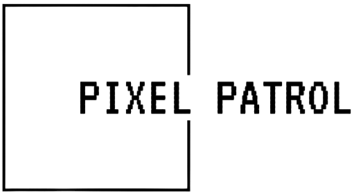
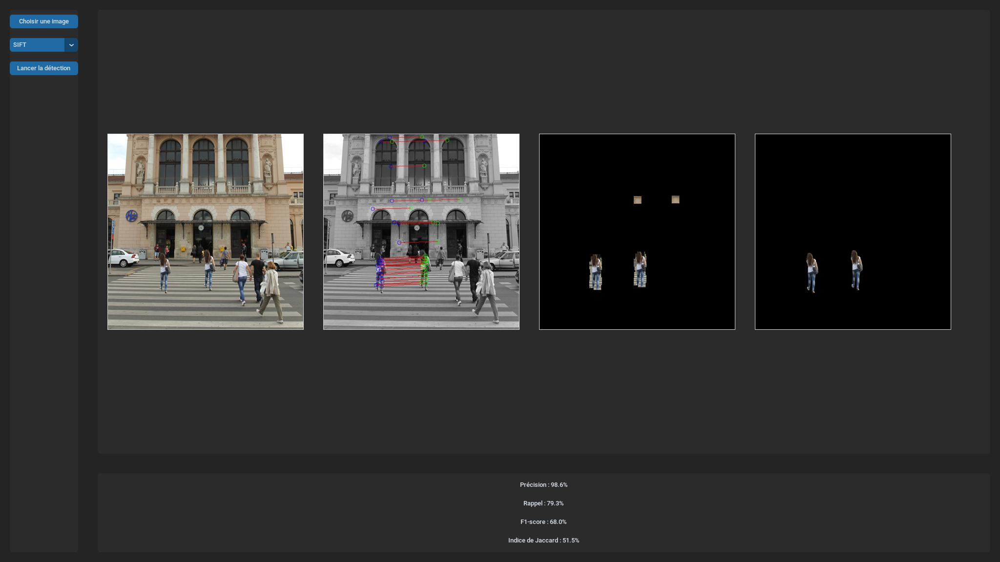
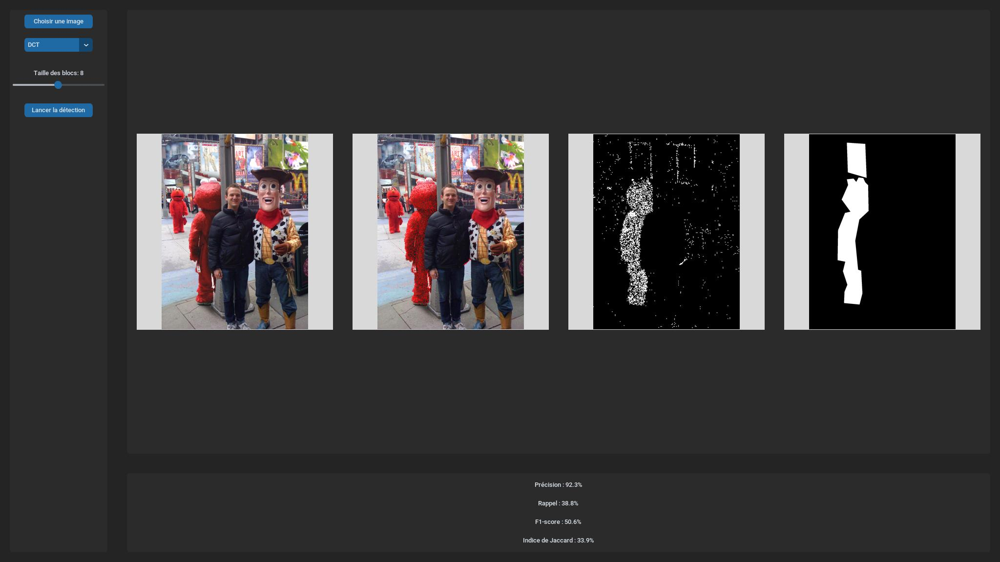
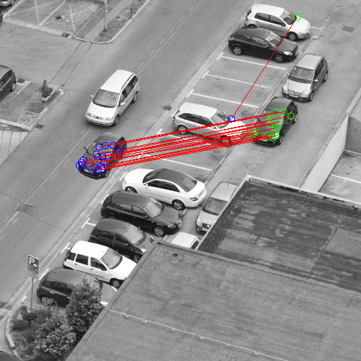
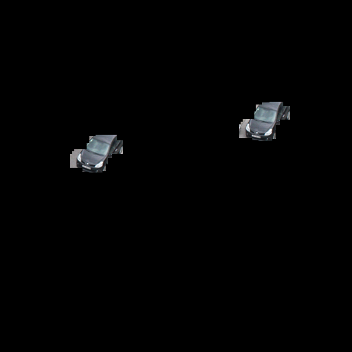
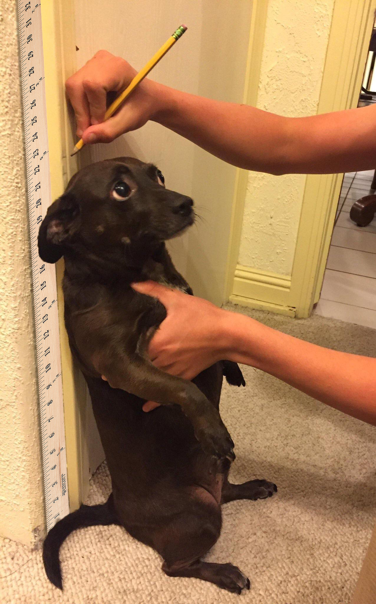
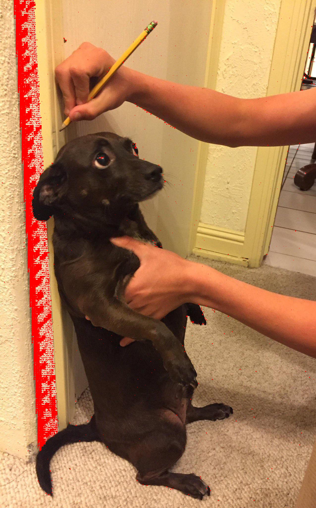
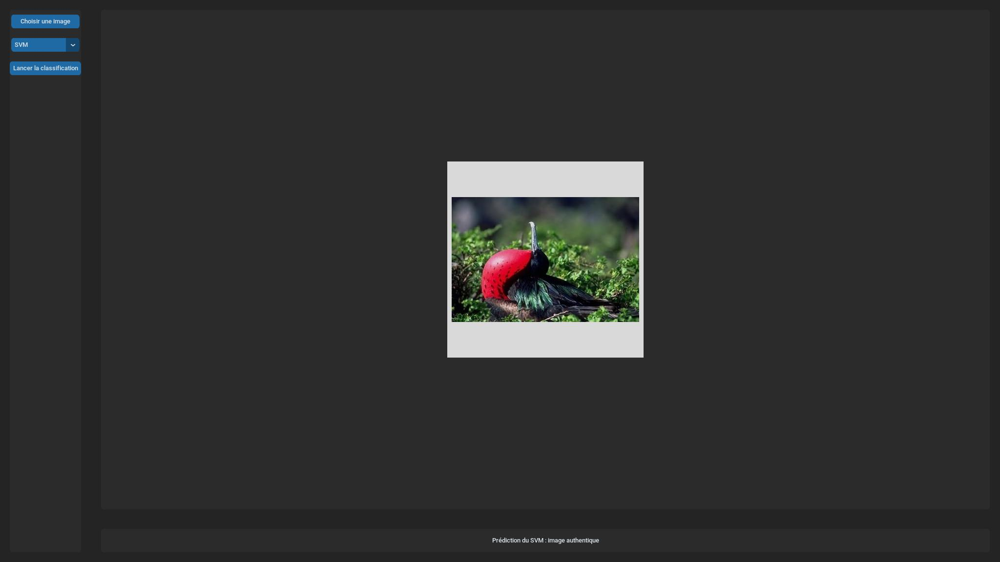

<div align="center">
  
</div>

## Détecteur de falsifications d'images

**Pixel Patrol** est une solution Python de détection de falsifications dans des images, utilisant des technologies d'analyse d'images pour identifier les modifications et manipulations d'images. Mon objectif est de fournir un outil fiable pour aider à maintenir l'intégrité et la véracité des contenus visuels. **Pixel Patrol** utilise **CustomTKinter**, **PIL**, **scikit-learn** et **OpenCV**. 

Pour plus d'informations sur le projet et les implémentations, veuillez consulter mon [support de soutenance orale](CRs/PixelPatrolOral.pdf).

<div align="center">
  
  
</div>

**Pixel Patrol** implémente la détection de falsifications par copy-move et par splicing. L'application propose aussi une détection de falsifications plus générale, en utilisant un SVM.

## Détection de copy-move (méthode SIFT et RANSAC)

<div align="center">
  
  
  
</div>

## Détection de splicing (méthode DCT)

<div align="center">
  
  
  
</div>

## Détection de falsification générale (méthode SVM)

<div align="center">
  
</div>

## Installation

Pour exécuter ce projet, vous aurez besoin de Python 3 et de `pip` installés sur votre système. Il est recommandé d'utiliser un environnement virtuel pour gérer les dépendances.

### Configuration de l'environnement virtuel

1. **Créer un environnement virtuel** :
    ```sh
    python3 -m venv pixel_patrol_env
    ```
    Cette commande crée un nouvel environnement virtuel nommé `pixel_patrol_env` dans le répertoire courant.

2. **Activer l'environnement virtuel** :
    - Sur Windows :
      ```sh
      .\pixel_patrol_env\Scripts\activate
      ```
    - Sur macOS et Linux :
      ```sh
      source pixel_patrol_env/bin/activate
      ```
    Une fois activé, votre invite de commande devrait vous avertir du changement d'environnement.

### Installation des dépendances

Avec l'environnement virtuel activé, installez les dépendances nécessaires à l'aide de `pip` :

```sh
pip install -r requirements.txt
```

## Utilisation

**Lancer le programme** :
```sh
python3 src/app.py
```

La fenêtre de l'application devrait s'ouvrir. Vous pouvez y choisir le mode de détection, charger une image, lancer la détection de falsification et visualiser l'image résultante après traitement.

## Structure du projet

- `src/` : contient les scripts source de l'application.
    - `app.py` : implémentation de l'interface graphique
    - `detection.py` : logique de détection de falsification dans une image
    - `svm.py` : contient les scripts pour entraîner le SVM
- `CRs` : contient les compte-rendus qui détaillent les avancements du projet
- `data` : contient des images à utiliser dans l'application
- `.gitignore` : répertorie les fichiers et dossiers à ignorer lors des ajouts sur le git
- `requirements.txt` : regroupe les dépendances nécessaires à l'utilisation du projet

## Auteurs

- JEAN Louis