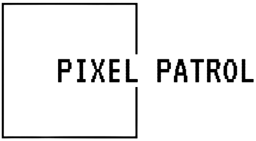
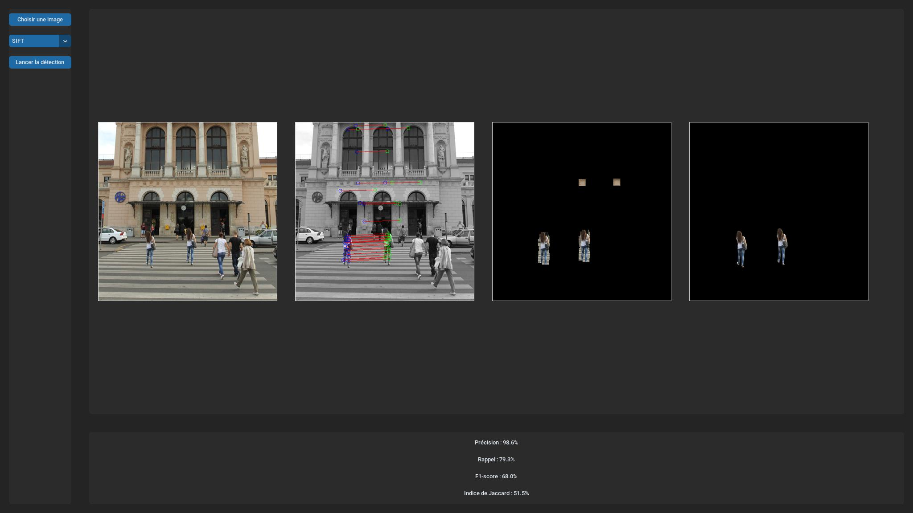
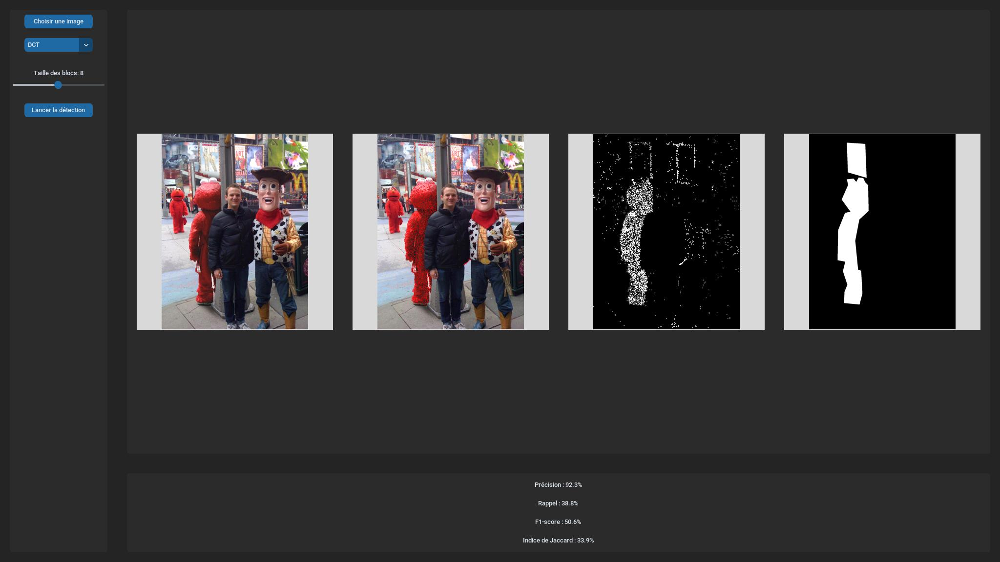
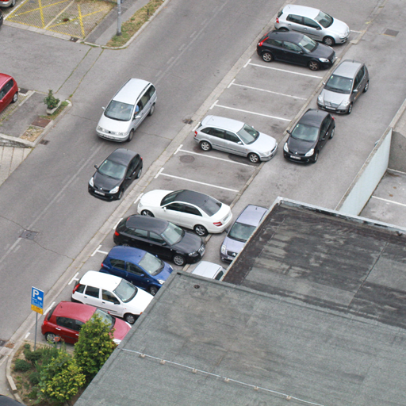
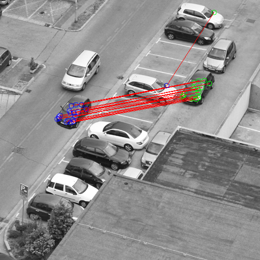
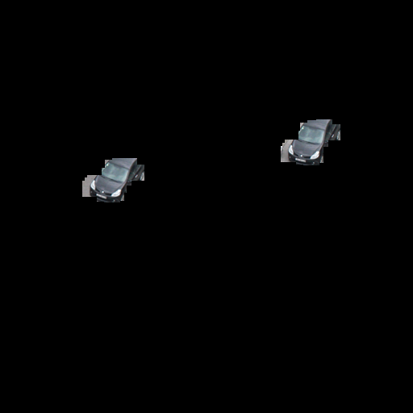
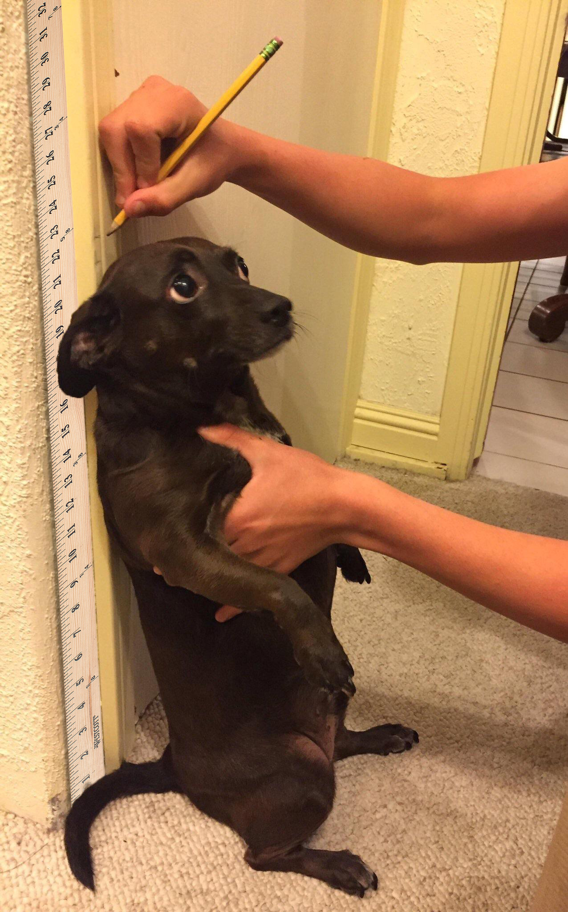
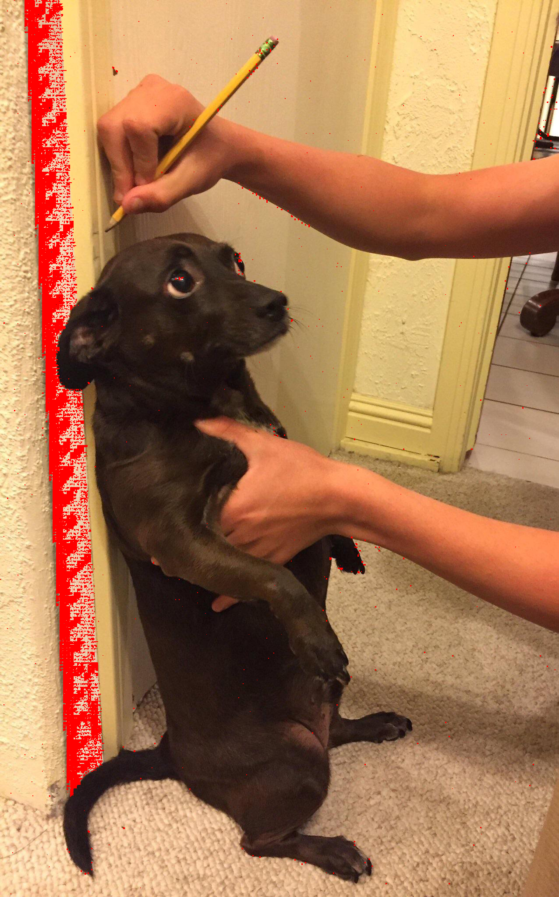
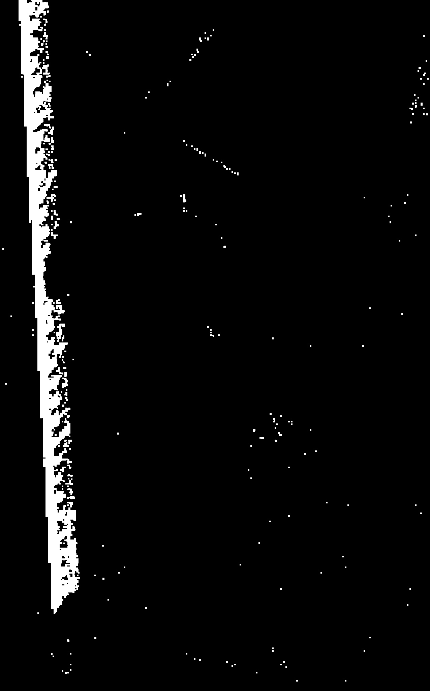
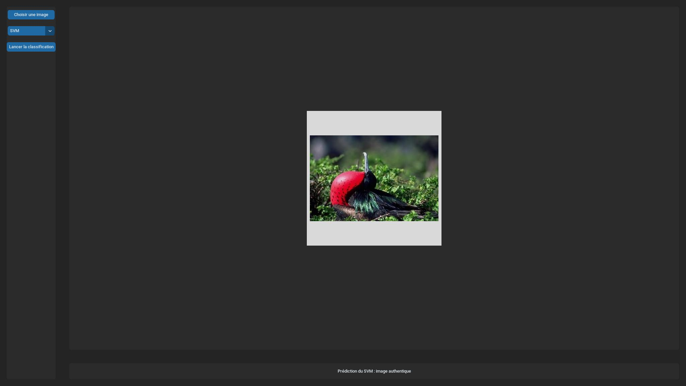

<div align="center">
  
  
  
  
  
  
</div>

<div align="center">
  
</div>

## Image tampering detector

**Pixel Patrol** is a Python solution for detecting tampering in images, using image analysis technologies to identify edits and manipulations. My goal is to provide a reliable tool to help maintain the integrity and truthfulness of visual content. **Pixel Patrol** uses **CustomTKinter**, **PIL**, **scikit-learn**, and **OpenCV**. This project was developed as part of the “Image Analysis and Processing” course in the IMAGINE master’s program (Université de Montpellier).

For more information about the project and implementations, please refer to my [oral defense slides](CRs/PixelPatrolOral.pdf) (only available in French).

<div align="center">
  
  
</div>

**Pixel Patrol** implements copy-move and splicing tampering detection. The application also provides a more general tampering detection using an SVM.

## Copy-move detection (SIFT and RANSAC method)

<div align="center">
  
  
  
</div>

## Splicing detection (DCT method)

<div align="center">
  
  
  
</div>

## General tampering detection (SVM method)

<div align="center">
  
</div>

## Installation

### Clone the repository

Clone the project using this command:

```bash
git clone git@github.com:louis-jean0/PixelPatrol.git
```

To run this project, you will need Python 3 and `pip` installed on your system. It is recommended to use a virtual environment to manage dependencies.

### Virtual environment setup

1. Create a virtual environment:
   ```bash
   python3 -m venv pixel_patrol_env
   ```
   This command creates a new virtual environment named `pixel_patrol_env` in the current directory.

2. Activate the virtual environment:
   - On Windows:
     ```bash
     .\pixel_patrol_env\Scripts\activate
     ```
   - On macOS and Linux:
     ```bash
     source pixel_patrol_env/bin/activate
     ```
   Once activated, your command prompt should indicate the environment change.

### Install dependencies

With the virtual environment activated, install the required dependencies using `pip`:

```bash
pip install -r requirements.txt
```

## Usage

Launch the program:
```bash
python3 src/app.py
```

The application window should open. You can choose the detection mode, load an image, run tampering detection, and visualize the resulting processed image.

## Project structure

- `src/`: contains the application's source scripts.
  - `app.py`: GUI implementation
  - `detection.py`: image tampering detection logic
  - `svm.py`: scripts to train the SVM
- `CRs`: contains reports detailing the project's progress (only in French)
- `data`: contains images to use in the application
- `.gitignore`: lists files and folders to ignore when committing to git
- `requirements.txt`: groups the dependencies required to use the project

## License

This project is licensed under the MIT License - see the [LICENSE](LICENSE) file for details.

## Author

- JEAN Louis
